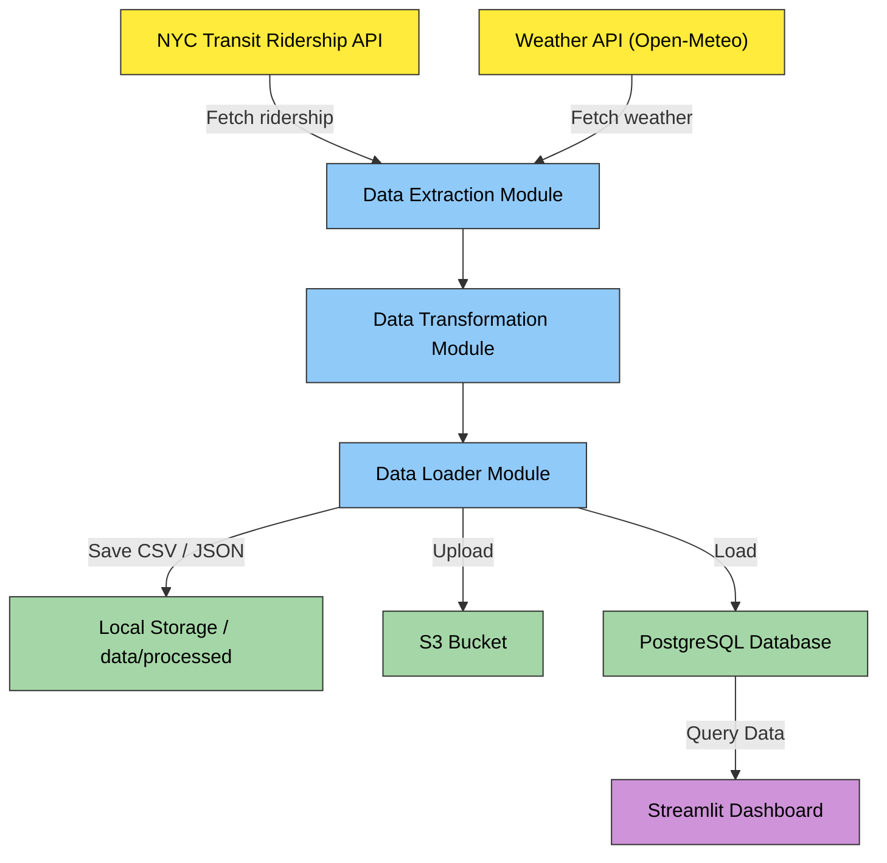
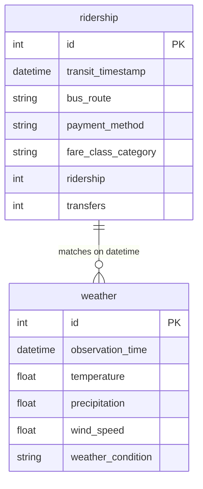
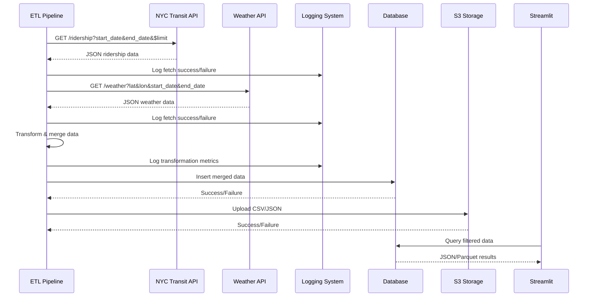

# NYC MTA Ridership + Weather ETL Project: Diagrams

## 1. Data Flow Diagram (End-to-End ETL)

```mermaid
flowchart TD
    A["NYC Transit Ridership API"] -->|Fetch ridership| B["Data Extraction Module"]
    C["Weather API (Open-Meteo)"] -->|Fetch weather| B
    B --> D["Data Transformation Module"]
    D --> E["Data Loader Module"]
    E -->|Save CSV / JSON| F["Local Storage / data/processed"]
    E -->|Upload| G["S3 Bucket"]
    E -->|Load| H["PostgreSQL Database"]
    H -->|Query Data| I["Streamlit Dashboard"]

    classDef api fill:#ffeb3b,stroke:#333,stroke-width:1px,color:#000;
    classDef etl fill:#90caf9,stroke:#333,stroke-width:1px,color:#000;
    classDef storage fill:#a5d6a7,stroke:#333,stroke-width:1px,color:#000;
    classDef dashboard fill:#ce93d8,stroke:#333,stroke-width:1px,color:#000;

    class A,C api;
    class B,D,E etl;
    class F,G,H storage;
    class I dashboard;
```

## 2. Database Schema Design

```mermaid
erDiagram
    ridership {
        int id PK
        datetime transit_timestamp
        string bus_route
        string payment_method
        string fare_class_category
        int ridership
        int transfers
    }

    weather {
        int id PK
        datetime observation_time
        float temperature
        float precipitation
        float wind_speed
        string weather_condition
    }

    ridership ||--o{ weather : "matches on datetime"
```

## 3. API Request/Response Flow

```mermaid
sequenceDiagram
    participant ETL as ETL Pipeline
    participant MTA as NYC Transit API
    participant Weather as Weather API
    participant Logger as Logging System
    participant DB as Database
    participant S3 as S3 Storage
    participant Dashboard as Streamlit

    ETL->>MTA: GET /ridership?start_date&end_date&$limit
    MTA-->>ETL: JSON ridership data
    ETL->>Logger: Log fetch success/failure

    ETL->>Weather: GET /weather?lat&lon&start_date&end_date
    Weather-->>ETL: JSON weather data
    ETL->>Logger: Log fetch success/failure

    ETL->>ETL: Transform & merge data
    ETL->>Logger: Log transformation metrics

    ETL->>DB: Insert merged data
    DB-->>ETL: Success/Failure

    ETL->>S3: Upload CSV/JSON
    S3-->>ETL: Success/Failure

    Dashboard->>DB: Query filtered data
    DB-->>Dashboard: JSON/Parquet results
```